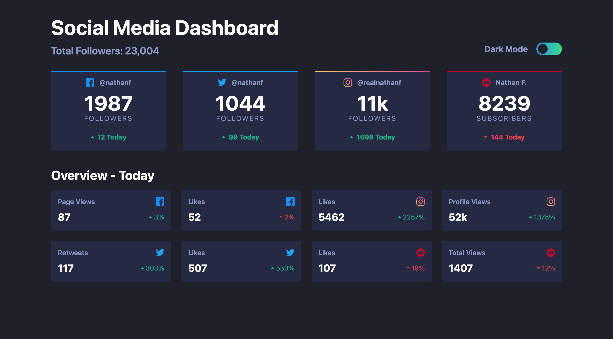
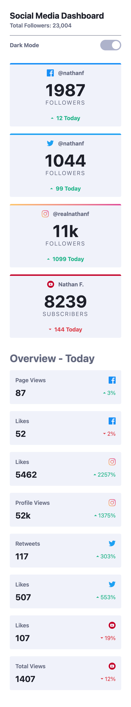
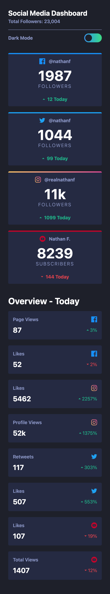

# Frontend Mentor - Social media dashboard with theme switcher solution

This is a solution to the [Social media dashboard with theme switcher challenge on Frontend Mentor](https://www.frontendmentor.io/challenges/social-media-dashboard-with-theme-switcher-6oY8ozp_H). 


## Table of contents

- [Overview](#overview)
  - [The challenge](#the-challenge)
  - [Screenshot](#screenshot)
  - [Links](#links)
- [My process](#my-process)
  - [Built with](#built-with)
- [🧗‍♀️ What I learned](#🧗‍♀️-what-i-learned)

## Overview

### The challenge

Users should be able to:

- View the optimal layout for the site depending on their device's screen size
- See hover states for all interactive elements on the page
- Toggle color theme to their preference

### Screenshot
#### Desktop 1044px

|     <a href="screenshots/Desktop1440-light.png"></a>   |
| ---------------------------------------------- |
|     <a href="screenshots/Desktop1440-dark.png"></a> |


#### Mobile 375px
|     <a href="screenshots/Mobile375-light.png"></a>   |
| ---------------------------------------------- |
|     <a href="screenshots/Mobile375-dark.png"></a>  |


## My process

### Built with

- Semantic HTML5 markup
- CSS custom properties
- Flexbox
- CSS Grid
- Mobile-first workflow
- [React](https://reactjs.org/) - JS library
- Tailwind

## 🧗‍♀️ What I learned

1. **Checkbox with Tailwind Equivalent**

   If our HTML markup is as follows:

   ```html
   <input type="checkbox" class="toggle__input"/>
   <div class="toggle__fill"></div>
   ```

   And our CSS is:

   ```css
   .toggle__input:checked ~ .toggle__fill::after {
     content: 'after';
   }
   ```

   Then the equivalent in Tailwind is:

   ```jsx
   <input className="peer" type="checkbox"/>
   <div className="peer-checked:after:content-['after']"></div>
   ```

2. **Working Toggle in React + Tailwind**

   ```jsx
   <label>
     {/* Toggle input */}
     <input
       className="inline-block peer"
       type="checkbox"
       name="darkmode"
       id="darkmode"
     />

     {/* Toggle fill */}
     <div
       className="outline-1 relative w-[--toggle-w] h-[--toggle-h] rounded-[--toggle-bradius] bg-red-100
         after:outline-1 after:bg-yellow-500 after:content-[''] after:absolute after:top-0 after:left-0
         after:m-[--after-fill-m] after:rounded-[--toggle-bradius]
         after:h-[--after-fill-w] after:w-[--after-fill-w]
         peer-checked:after:translate-x-[--toggle-h]">
     </div>
   </label>
   ```

3. **Setting Background with Linear Gradient in Tailwind**

   In `index.css`:

   ```css
   @import "tailwindcss";

   @theme {
     --color-instagram1: #fdc468;
     --color-instagram2: #df4996;
   }
   ```

   In a React component:

   ```jsx
   <div className="h-2 bg-gradient-to-r from-[--color-instagram1] to-[--color-instagram2]"></div>
   ```

4. **Changing Tailwind Classes Using React Props**

   ```jsx
   // The right way
   const colorVariant = {
     facebook: "h-2 bg-[--color-facebook]",
     twitter: "h-2 bg-[--color-twitter]"
   };

   <div className={`${colorVariant[account]}`}></div>
   ```

5. **Trailing `...` in Class Names**

   In JSX, adding a space before `...` ensures that class names are applied correctly.

   ```jsx
   // This will get applied
   <h3 className={`${colorVariant[curMode].semiBoldText} ...`}>{item}</h3>

   // This will NOT get applied
   <h3 className={`${colorVariant[curMode].semiBoldText}...`}>{item}</h3>
   ```

